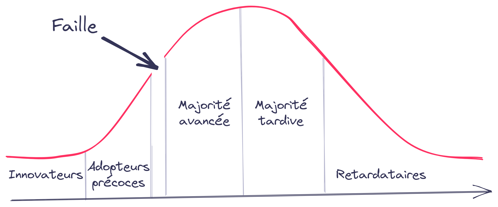

# Startup

---

## fournir une solution **innovante** 💡

avec

## une haute **valeur** ajoutée 💰️

pour

## un marché à croissance **rapide** 🚀

---

## Mises en production **rapides**

mais pas toujours rigoureuses

on va vite, mais on rate vite !

### **support utilisateur** devient la vraie valeur ajoutée

---

## **Découverte** du marché en continu

on n'a pas d'historique sur le produit

les utilisateurs découvrent leurs besoins

on prend des décision rapides, mais pas toujours les bonnes

### on doit pouvoir **changer le produit rapidement**

---

## Moyens **limités**

on a un nombre d'employés restreint

on a des budgets plus serrés pour les opérations

### on doit avoir **plusieurs chapeaux**

---

## Cible **mouvante**

on a un produit qui change vite

une forte compétition

### on doit être **flexible** sur les priorités

---

<!--
Les adopteurs précoces sont des fondus de technologie recherchant un changement radical,
alors que la majorité avancée veut une « amélioration de la productivité ».
Le second groupe veut un produit fini,
alors que le premier accepte les imperfections et
possède les compétences techniques pour voir immédiatement les avantages.

Le challenge d'une startup est de passer cette faille
c'est avant tout un challenge qualité
-->
