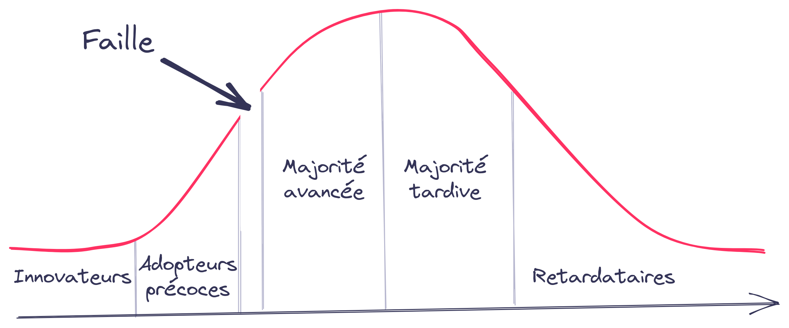

# Pourquoi faire **?**

---

# Startup **+** Quality

### where things gets quickly emotional

---

<!--
Les adopteurs précoces sont des fondus de technologie recherchant un changement radical,
alors que la majorité avancée veut une « amélioration de la productivité ».
Le second groupe veut un produit fini,
alors que le premier accepte les imperfections et
possède les compétences techniques pour voir immédiatement les avantages.
-->

---

Increase velocity
Build ownership
Fast feedback
User voice
Keep technical debt low
Prevent data quality debt

---

Culture qualité

Modern testing
Agile practices
Communication
Context-driven
UX
